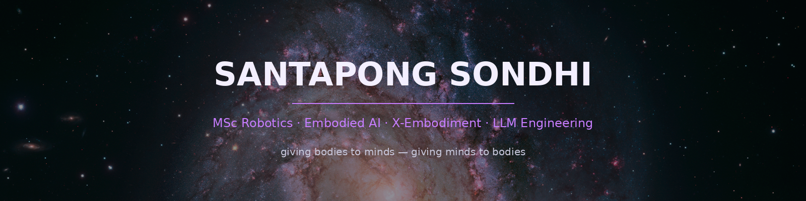

<!-- ═══════════════ COSMIC PROFILE ═══════════════ -->

<div align="center">



<div align="center">

[](https://github.com/santapong)

</div>

*Building at the intersection of LLMs, robots, and the infrastructure that makes them think.*

<br/>

[](https://www.linkedin.com/in/santapong-sondhi-11176034b)
[](mailto:santapongsondhi@gmail.com)
[](https://github.com/santapong)

</div>

---

## 🛰️ Mission Log

```yaml
identity:
  name: Santapong Sondhi
  class: Engineer × Embodied-AI Researcher
  origin: Bangkok, Thailand
  trajectory: B.Eng Mechatronics (KMITL) → MSc Robotics & Embodied AI

research_interests:
  - 🦾 Cross-embodiment (X-Embodiment) — one policy, many bodies
  - 🤖 Language-guided manipulation & ROS 2 robotics
  - 🧠 LLM engineering — observable, deterministic agent orchestration
```

<div align="center">

> *"Intelligence is cheap; grounding is hard.*
> *I build systems where language meets physics."*

</div>

---

## 🌌 Star Systems

<table>
<tr>
<td width="50%" valign="top">

### 🦾 RoboLLM
**X-Embodiment Workbench**

Learning-first robotics lab — Claude drives a real ROS 2 robot through MCP while you drive the same robot from a browser dashboard. Gesture teleop on a Kinova Gen3, hand-following arm, webcam→3D scanner that turns objects into URDF.

`Python` `ROS 2` `MCP` `MuJoCo`

🔗 [github.com/santapong/RoboLLM](https://github.com/santapong/RoboLLM)

</td>
<td width="50%" valign="top">

### 🌑 Accretion
**LLM Engineering Lab**

Local-first observable control plane for supervising Codex and Claude Code — deterministic planning, verifier-gated feedback loops, isolated workspaces, durable execution traces. v0.2 released.

`Python` `FastAPI` `React` `PostgreSQL`

🔗 [github.com/santapong/Accretion](https://github.com/santapong/Accretion)

</td>
</tr>
<tr>
<td width="50%" valign="top">

### 🔮 Nexus
**The Constellation Builder**

Distributed multi-agent platform — autonomous workers coordinating over Kafka with shared memory and MCP tools.

`Python` `Kafka` `MCP` `Postgres`

🔗 [github.com/santapong/Nexus](https://github.com/santapong/Nexus)

</td>
<td width="50%" valign="top">

### 🛸 Muninn
**The Odin's Messenger**

Autonomous drone on a Raspberry Pi Pico W — migrating from PID to LQG optimal control.

`C/C++` `MicroPython` `MAVLink`

🔗 [github.com/santapong/Muninn](https://github.com/santapong/Muninn)

</td>
</tr>
</table>

---

## ⚛️ The Standard Model of my tooling

| Force | Carrier Particles |
|---|---|
| 🦾 **Strong** — Robotics | ROS 2 · MuJoCo · PyBullet · MAVLink |
| 🧠 **Electromagnetic** — LLMs & Agents | LangChain · Claude · MCP · Codex · Vector DBs |
| 💻 **Weak** — Languages | Python · TypeScript · Rust · Go · SQL |
| 🌐 **Gravity** — Web & Infra | FastAPI · Next.js · Docker · K8s · Linux |

---

## 🚀 Launch Timeline

```
KMITL ──●── 🎓 B.Eng Mechatronics & Automation
         \
2024 ─────●─ 🤖 Robots, agents & LLM tooling take over the repos
           \
2026 ────────●─ 🦾 MSc Robotics & Embodied AI · ships RoboLLM + Accretion v0.2
              \
next ───────────✦ 🎯 Cross-embodiment policies that transfer across robot bodies
```

---

<details>
<summary><b>🔭 Deep-field observations (GitHub stats)</b></summary>

<br/>

<div align="center">


<a href="https://github.com/santapong">
  
</a>


</div>

</details>

---

<div align="center">


</div>

<!-- end of transmission -->
